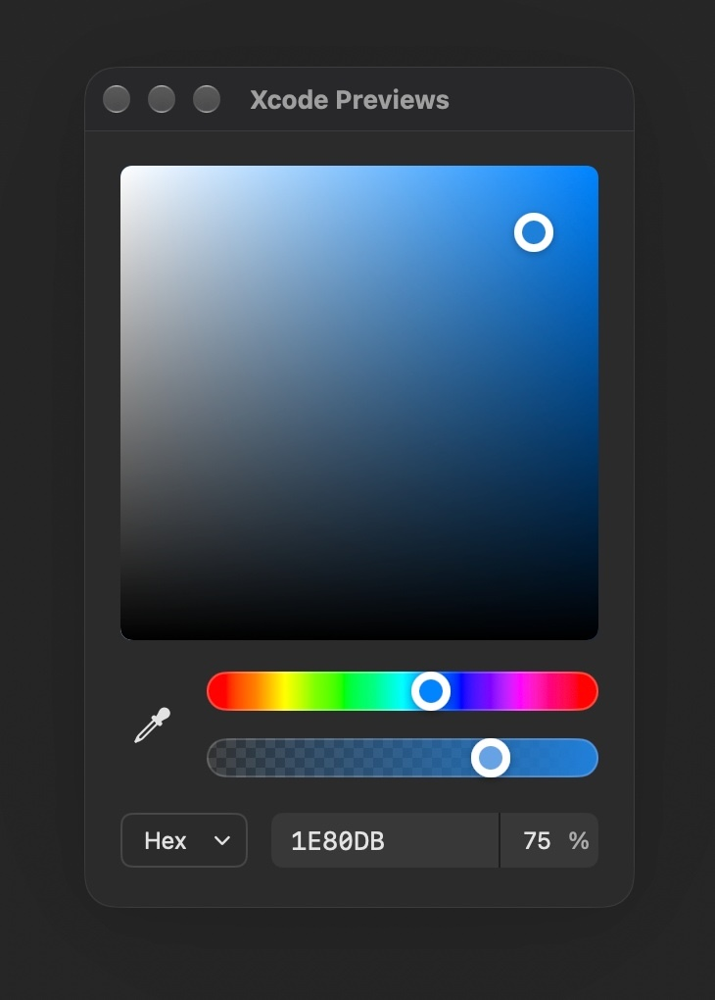

# FigmaColorPicker

A standalone macOS 14+ SwiftUI color picker extracted from Solid.
No third-party dependencies.



Includes the original saturation/brightness and saturation/lightness surfaces,
hue and alpha sliders, HSB/RGB/HSL numeric inputs, HEX input/output, and screen eyedropper.
Original MIT attribution is in `LICENSE`.

## Installation

In Xcode, choose **File > Add Package Dependencies > Add Local** and select this
directory. Link the `FigmaColorPicker` product to your app target.

For another Swift package:

```swift
dependencies: [
    .package(url: "https://github.com/winddpan/FigmaColorPicker", branch: "main")
],
targets: [
    .target(
        name: "YourApp",
        dependencies: [.product(name: "FigmaColorPicker", package: "FigmaColorPicker")]
    )
]
```

## Color button

```swift
import SwiftUI
import FigmaColorPicker

struct ContentView: View {
    @State private var color = NSColor.systemRed

    var body: some View {
        FigmaColorPicker(selection: $color)
    }
}
```

## Custom trigger

```swift
@State private var color = NSColor.systemBlue
@State private var showsPicker = false

var body: some View {
    Button("Choose color") { showsPicker = true }
        .figmaColorPickerPopover(
            isPresented: $showsPicker,
            selection: $color,
            arrowEdge: .bottom
        )
}
```

These are the only two public entry points. Editor controls and conversion helpers
are internal. The popover is 320 points wide and uses SwiftUI's native dismissal.
The panel, fields, borders, and checkerboard adapt to the host's light/dark
appearance. The demo includes a Light/Dark segmented control to preview both.

## Data ownership

- The caller's `Binding<NSColor>` is the source of truth. Edits write through
  immediately; dismissal keeps them. Implement any save/cancel transaction in the
  caller by binding to a draft color.
- External binding changes update an open editor; separate pickers share no state.
- The editor keeps temporary component coordinates to preserve hue and saturation
  at achromatic colors, plus selected model, HEX input draft, and sampling state.
- Display P3 input stays in Display P3. Other convertible inputs are edited in
  sRGB. Values are bounded to the standard 0...1 editing range. Nonconvertible
  colors (such as pattern colors) display a black editing fallback; opening the
  popover alone does not overwrite the original value.
- Select HEX in the same model menu to display and edit the current color as
  `RRGGBB` or `RRGGBBAA` (alpha last), without a hash prefix. Input accepts 6 or
  8 hex digits in the current editing color space; pasted values may include `#`.
  Press Return to commit;
  invalid input leaves the color unchanged. Escape restores the current value.
  Six-digit input sets alpha to 100%. A separate alpha input sits alongside HEX.
  Sliders, sampling, and external updates refresh the displayed HEX value.
- There is no Defaults, Core Data, saved-color library, global publisher, or
  clipboard access.

The original Solid app is retained separately as the extraction source.

## Verification

```sh
swift build
swift test
```

The tests cover grayscale normalization, P3/alpha preservation, achromatic hue and
saturation, and strict hex parsing. `Example/PickerDemo` is a standalone consumer
for manually checking presentation, live changes, external updates, and reopening:

```sh
cd Example/PickerDemo
swift run
```
